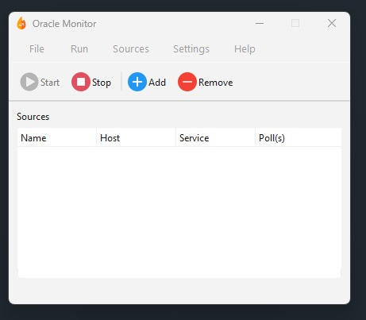
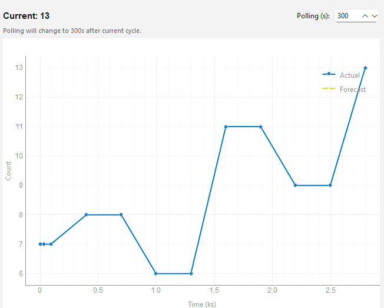

# Oracle Queue Monitor

A simple tool to monitor Oracle database queues with live charts and basic anomaly detection.  
Built with PyQt6 and pyqtgraph.
  
## Case Flow
1. Define one or more database sources (connection info + query).
2. Each source runs your custom query that returns a single numeric value (e.g., `SELECT COUNT(*) ...`).
3. Values are collected at the chosen polling interval.
4. Results are shown in live plots, one window per source.
5. An anomaly is flagged if the queue grows unusually fast (upward-only detection).

## Notes
The application may require the Oracle Instant Client for older Oracle versions.  
It can be downloaded from [Oracle Instant Client](https://www.oracle.com/database/technologies/instant-client/downloads.html) and the installation path must be set in `settings.json` or from the GUI under Settings.  

For anomaly detection, the application uses a rolling [AutoRegressive (AR)](https://www.statsmodels.org/stable/generated/statsmodels.tsa.ar_model.AutoReg.html) model to forecast expected queue values.  
Only upward spikes are treated as anomalies, since queues can naturally drop to zero without indicating a problem.  

## Screenshots

<table>
  <tr>
    <td align="center">
       
      Main Window
    </td>
    <td align="center">
       
      Live Plot
    </td>
  </tr>
</table>
